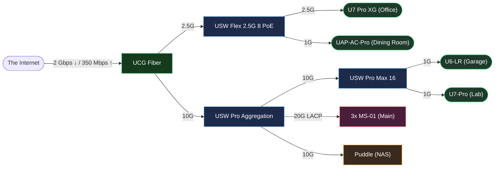

<div align="center">

# Kashall's Infrastructure

[](https://discord.gg/home-operations)&nbsp;&nbsp;&nbsp;
[](https://www.talos.dev/)&nbsp;&nbsp;&nbsp;
[](https://www.talos.dev/)&nbsp;&nbsp;&nbsp;
[](https://github.com/waifulabs/infrastructure/actions/workflows/renovate.yaml)

[](https://github.com/home-operations/kromgo/)&nbsp;&nbsp;&nbsp;
[](https://github.com/home-operations/kromgo/)&nbsp;&nbsp;&nbsp;
[](https://github.com/home-operations/kromgo/)&nbsp;&nbsp;&nbsp;
[](https://github.com/home-operations/kromgo/)&nbsp;&nbsp;&nbsp;
[](https://github.com/home-operations/kromgo/)&nbsp;&nbsp;&nbsp;
[](https://github.com/home-operations/kromgo/)&nbsp;&nbsp;&nbsp;
[](https://github.com/home-operations/kromgo/)

</div>

## Overview

This repository runs my **home lab** — a few computers in my house that host the apps and services my household depends on (media library, home automation, dashboards, chat, and more) instead of renting them from big cloud providers.

The twist: nothing is configured by hand. The *entire* setup is written down as code in this repo, and software continuously keeps the real machines matched to it. Push a change and it rolls out on its own; if a machine dies, I can rebuild it from scratch in minutes.

<details>
<summary>🤓 <b>For the technically curious</b> — the interesting bits</summary>

- **[Talos Linux](https://www.talos.dev/)** — a minimal, immutable OS with no SSH or shell; every node is defined entirely from [`talos/`](./talos/) and managed over an API.
- **[Flux](https://fluxcd.io/) GitOps** — the cluster reconciles itself to match this repo. Every change is a reviewed commit, never a manual `kubectl apply`.
- **[Cilium](https://cilium.io/) + BGP** — pods get routable IPs and LoadBalancer services are advertised straight to my UniFi router via BGP.
- **[External DNS UniFi Webhook](https://github.com/kashalls/external-dns-unifi-webhook)** — a webhook I wrote so DNS records publish directly to UniFi, no extra resolvers.
- **[Renovate](https://github.com/renovatebot/renovate)** — container images and Helm charts stay current through automated pull requests.
- **[VolSync](https://volsync.readthedocs.io/) + ZFS** — persistent data is snapshotted and backed up off-site, on top of a dedicated [TrueNAS box](#-hardware).

</details>

Built from onedr0p's [cluster template](https://github.com/onedr0p/flux-cluster-template) — you don't need a fancy multi-node setup to run your own. Come say hi in the [Home Operations](https://discord.gg/home-operations) Discord.

### Directory Helper

This repository uses the following layout for [Kubernetes](./kubernetes/).

```sh
📁 bootstrap
├── 📝 helmfile.yaml         # Helmreleases required to bootstrap Flux.
└── 📝 secrets.yaml.tpl      # Secrets required to bootstrap Flux.
📁 kubernetes
├── 📁 apps                  # Application configurations.
└── 📁 components            # Shared Kustomize components.
📁 talos
├── 📁 nodes                 # Per-node override configurations.
├── 📝 machineconfig.yaml.j2 # Base Talos configuration for all nodes.
└── 📝 talos.env             # Kubernetes and Talos version variables.
📁 unifi                     # Configuration files for UniFi
```

## ☁️ Cloud Dependencies

Most things are self-hosted, but a few critical pieces live in the cloud — to sidestep chicken-and-egg problems and stay reachable when the cluster is down.

| Service                                                 | Use                                                            | Cost           |
|---------------------------------------------------------|----------------------------------------------------------------|----------------|
| [1Password](https://1password.com/)                     | Secrets with [External Secrets](https://external-secrets.io/)  | ~$55/yr        |
| [Cloudflare](https://www.cloudflare.com/)               | Domains, Workers, Pages, and R2                                | ~$240/yr       |
| [Backblaze B2](https://www.backblaze.com/cloud-storage) | Backups                                                        | $1/m        |
| [GitHub](https://github.com/)                           | Hosting this repository and continuous integration/deployments | Free           |
| [Let's Encrypt](https://letsencrypt.org/)               | Issuing SSL Certificates with Cert Manager                     | Free           |
| [Migadu](https://migadu.com/)                           | Email Hosting                                                  | ~$20/yr        |
| [Pushover](https://pushover.net/)                       | Kubernetes Alerts and application notifications                | Free           |
| [UniFi Site Manager](https://unifi.ui.com)              | UniFi External Access Management                               | Free           |
|                                                         |                                                                | Total: ~$10/mo |

---

## 💻 Networking

Everything runs on a UniFi stack split into [VLANs](#networks--vlans) for isolation. The cluster hands out service IPs from a dedicated network and advertises them to the router over **BGP** (see [Cilium + BGP](#overview)), so a load-balanced app gets a real, routable address on my LAN — no port-forwarding or ingress hacks.

### Networking Diagram



### Networks & Vlans

| Name                | VLAN | Description                                                                         |
|---------------------|------|-------------------------------------------------------------------------------------|
| Management          | 1    | Servers + Network Management                                                        |
| Devices             | 2    | Wireless Devices and Workstations                                                   |
| IoT                 | 3    | Small devices that *have the potential* to be compromised, so they don't get to talk to each other. |
| Services            | 4    | No DHCP — dedicated network for the cluster's BGP-advertised LoadBalancer IPs        |
| "I Don't Trust You" | 86   | Non-affiliated organization issued devices (school or work devices)                 |

### 🌐 DNS

I wrote [External DNS UniFi Webhook](https://github.com/kashalls/external-dns-unifi-webhook) so [External DNS](https://github.com/kubernetes-sigs/external-dns/) can publish the cluster's service and ingress hostnames straight to UniFi's built-in DNS — no extra resolvers or moving parts.

---

## 🔧 Hardware

| Device              | Count | OS Disk Size | Data Disk Size | Ram  | Operating System | Purpose          |
|---------------------|-------|--------------|----------------|------|------------------|------------------|
| UCG Fiber           | 1     | -            | 1TiB NVMe      | -    | UniFi OS         | Router           |
| USW Flex 2.5G 8 PoE | 1     | -            | -              | -    | UniFi OS         | Switching        |
| USW Pro Max 16 PoE  | 1     | -            | -              | -    | UniFi OS         | Switching        |
| USW Pro Aggregation | 1     | -            | -              | -    | UniFi OS         | Aggregation      |
| U7 Pro XG           | 1     | -            | -              | -    | -                | Office AP        |
| U6 LR               | 1     | -            | -              | -    | -                | Garage AP        |
| UDB Switch          | 1     | -            | -              | -    | UniFi OS         | Garage Workbench |
| USP-PDU-Pro         | 1     | -            | -              | -    | -                | Rack PDU         |
| MS-01               | 3     | 1TB NVMe     | 2TB PM9A3 U.2  | 96GB | Talos            | Main Cluster     |
| Puddle              | 1     | 1TB NVMe     | 6x 12TB + 2TB   | 256GB| TrueNAS SCALE   | NAS              |
| JetKVM              | 1     | 16GB (Flash) | -              | -    | JetKVM           | Network KVM      |
| Eaton 5PX1500RT     | 1     | -            | -              | -    | -                | UPS              |
| Meshtastic MQTT GW  | 1     | -            | -              | -    | -                | MQTT GW          |
| SMLIGHT SLZB-06M    | 1     | -            | -              | -    | -                | Matter Gateway   |

<details>
  <summary>💾 Puddle — TrueNAS SCALE storage</summary>

```sh
💾 Puddle                          # TrueNAS SCALE · 45HomeLab HL15 · 256 GB RAM
📦 boot-pool                       # single
└── 💿 1 TB Kingston NV3 NVMe
📦 puddle
├── 🗄️ data (raidz2-0)            # 6-wide RAIDZ2
│   ├── 💿 4 × 12 TB Seagate IronWolf
│   └── 💿 2 × 12 TB Seagate Exos 7E8
├── ⚡ cache (L2ARC)
│   └── 💿 2 × 1.92 TB Samsung PM9A3 NVMe
└── 🔁 spare
    └── 💿 1 × 12 TB Seagate IronWolf
🧊 unassigned
└── 💿 750 GB Intel Optane NVMe    # future SLOG
```

</details>

---

## ⭐ Stargazers

<div align="center">

[](https://star-history.com/#waifulabs/infrastructure&Date)

</div>

---

## Inspiration

Thanks to all the people who donate their time to the [Home Operations](https://discord.gg/home-operations) community.

Special thanks to: [ᗪєνιη ᗷυнʟ](https://github.com/onedr0p/home-cluster), [Bᴇʀɴᴅ Sᴄʜᴏʀɢᴇʀs](https://github.com/bjw-s-labs/k8s-gitops), and [Toboshii Nakama](https://github.com/toboshii/home-cluster) for their assistance.

Check out [kubesearch.dev](https://kubesearch.dev) to see what other users are running in their kubernetes home labs!
